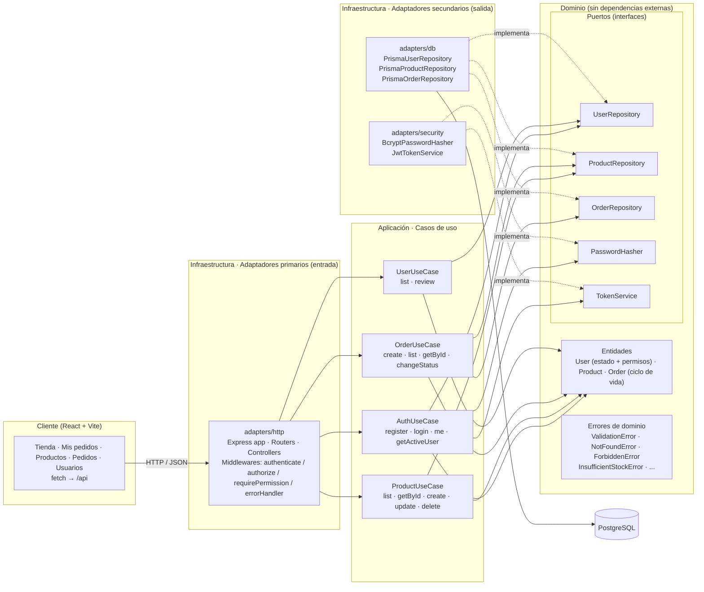

# Materiales El Constructor — E-commerce con arquitectura hexagonal

Tienda en línea de materiales de construcción desarrollada como práctica universitaria.

- **Backend** (`/server`): Node.js + Express + Prisma ORM (PostgreSQL) + bcryptjs + JWT.
- **Frontend** (`/client`): React 18 + Vite 5, CSS con tokens (OKLCH) e iconos Lucide.
- **Roles y permisos:** cualquier persona crea su cuenta y compra de inmediato; el administrador habilita o retira el acceso a la gestión de **Productos** y **Pedidos**, y puede revocar cuentas.

**Repositorio:** https://github.com/Rorre12/ecommerce-practica


## Documentación

| Documento | Contenido |
|-----------|-----------|
| [Documentacion-Ecommerce-Practica.pdf](Documentacion-Ecommerce-Practica.pdf) | Documento de entrega en PDF |
| [docs/README.md](docs/README.md) | Índice general |
| [docs/arquitectura.md](docs/arquitectura.md) | Capas hexagonales, puertos, adaptadores y flujo de una petición |
| [docs/api.md](docs/api.md) | Referencia completa de la API REST con ejemplos |
| [docs/base-de-datos.md](docs/base-de-datos.md) | Modelo de datos, diagrama ER, migraciones y seed |
| [docs/frontend.md](docs/frontend.md) | Pantallas de la SPA, permisos y cliente HTTP |
| [docs/instalacion.md](docs/instalacion.md) | Variables de entorno, ejecución local, producción y problemas frecuentes |
| [docs/auditoria-diseno.md](docs/auditoria-diseno.md) | Sistema visual y auditoría de diseño (UI UX Pro Max + Hallmark) |

---

## 1. Diagrama arquitectónico (Hexagonal / Puertos y Adaptadores)



**Regla de dependencias:** las flechas apuntan siempre hacia el dominio. El dominio no importa Express, Prisma ni bcrypt; solo define puertos. `src/index.js` es la **raíz de composición**, el único lugar donde se instancian los adaptadores concretos y se inyectan en los casos de uso.

---

## 2. Roles, permisos y pantallas

| Quién | Cómo se obtiene | Pantallas |
|-------|-----------------|-----------|
| **Comprador** | Al registrarse (nivel más bajo, sin espera) | Tienda · Mis pedidos |
| Comprador + permiso `PRODUCTS` | Lo asigna el admin | + Productos (crear, editar, eliminar) |
| Comprador + permiso `ORDERS` | Lo asigna el admin | + Pedidos (ver todos y cambiar su estado) |
| **Administrador** | Lo crea el seed | Tienda · Productos · Pedidos · Usuarios (todo) |

- El admin cambia permisos o revoca el acceso desde **Usuarios**. El cambio aplica en la siguiente petición del usuario, sin cerrar sesión, porque el servidor recarga el usuario desde la base de datos en cada petición.
- Las reglas se validan en el **backend**. Ocultar pestañas en el frontend es solo una ayuda visual; una llamada directa a la API sin permiso responde `403`.

---

## 3. Estructura del proyecto

```
ecommerce-practica/
├── docker-compose.yml            # PostgreSQL local (opcional)
├── README.md
├── Documentacion-Ecommerce-Practica.pdf   # Documento de entrega
├── docs/                         # Documentación técnica + capturas (docs/img)
├── server/
│   ├── .env.example
│   ├── prisma/
│   │   ├── schema.prisma         # User, Product, Order, OrderItem + enums
│   │   ├── migrations/           # init · roles_permisos_materiales · registro_directo
│   │   └── seed.js               # Admin + 12 materiales de construcción
│   └── src/
│       ├── index.js              # Raíz de composición (inyección de dependencias)
│       ├── domain/
│       │   ├── errors.js
│       │   ├── entities/         # User.js · Product.js · Order.js
│       │   └── ports/            # UserRepository · ProductRepository · OrderRepository
│       │                         # PasswordHasher · TokenService
│       ├── application/          # AuthUseCase · ProductUseCase · OrderUseCase · UserUseCase
│       └── infrastructure/
│           └── adapters/
│               ├── http/         # app.js · routes/ · controllers/ · middlewares/
│               ├── db/           # prismaClient · Prisma*Repository
│               └── security/     # BcryptPasswordHasher · JwtTokenService
└── client/
    ├── index.html                # Fuentes (Google Fonts) y favicon
    ├── public/favicon.svg
    ├── vite.config.js            # Proxy /api → http://localhost:4000
    └── src/
        ├── main.jsx · App.jsx · api.js · format.js · styles.css
        ├── components/ui.jsx     # Logotipo, avisos, estados, iconos de categoría
        └── modules/
            ├── auth/AuthView.jsx
            ├── store/StoreView.jsx
            ├── products/ProductsView.jsx
            ├── orders/OrdersView.jsx
            └── users/UsersView.jsx
```

---

## 4. Modelo de datos (Prisma / PostgreSQL)

| Entidad     | Campos |
|-------------|--------|
| `User`      | id, email (único), password (hash bcrypt), role (`ADMIN` \| `CUSTOMER`), status (`APPROVED` \| `REJECTED` \| `PENDING`), permissions (`PRODUCTS`, `ORDERS`), createdAt |
| `Product`   | id, name, price (Decimal 10,2), stock, unit (saco, m³, varilla…), category, createdAt, updatedAt |
| `Order`     | id, userId → User, total (Decimal 12,2), status (`PENDING` → `CONFIRMED` → `SHIPPED` → `DELIVERED` \| `CANCELLED`), createdAt |
| `OrderItem` | id, orderId → Order, productId → Product, quantity, price (precio congelado al comprar) |

---

## 5. Especificación de endpoints

Base URL: `http://localhost:4000/api` · Autenticación: `Authorization: Bearer <token>` · Error: `{ "error": { "code", "message", "details" } }`

| Método | Ruta | Acceso | Descripción |
|--------|------|--------|-------------|
| GET | `/api/health` | Público | Estado de la API |
| POST | `/api/auth/register` | Público | Crea un comprador y devuelve `{ user, token }` |
| POST | `/api/auth/login` | Público | `{ user, token }`; `403` si el acceso fue revocado |
| GET | `/api/auth/me` | Sesión | Usuario actual con permisos vigentes |
| GET | `/api/products` · `/:id` | Público | Catálogo |
| POST · PUT · DELETE | `/api/products[/:id]` | Permiso `PRODUCTS` | Gestión del catálogo |
| POST | `/api/orders` | Sesión | Crear pedido (descuenta stock) |
| GET | `/api/orders` | Sesión | Pedidos propios |
| GET | `/api/orders?scope=all` | Permiso `ORDERS` | Todos los pedidos |
| GET | `/api/orders/:id` | Dueño o `ORDERS` | Detalle |
| PATCH | `/api/orders/:id/status` | Permiso `ORDERS` | Avanzar o cancelar (cancelar devuelve stock) |
| GET | `/api/users[?status=]` | Admin | Lista de usuarios |
| PATCH | `/api/users/:id` | Admin | Cambiar `permissions` y/o `status` |

El detalle con cuerpos, respuestas y ejemplos `curl` está en [docs/api.md](docs/api.md).

---

## 6. Reglas de negocio implementadas

- Las contraseñas se hashean con **bcryptjs** a través del puerto `PasswordHasher` y nunca se devuelven en la API.
- El registro público crea compradores activos y sin permisos de gestión. El administrador inicial lo crea el seed.
- El acceso de un administrador no se puede modificar desde el panel.
- Al crear un pedido:
  1. El dominio (`Order.create` → `Product.assertStock`) valida cantidades y stock.
  2. El repositorio descuenta el stock **dentro de una transacción** con un `UPDATE ... WHERE stock >= cantidad`, así dos pedidos simultáneos no pueden dejar stock negativo.
  3. El precio de cada línea queda congelado en `OrderItem.price` y el total se calcula en centavos.
- Ciclo de vida del pedido: solo se permiten las transiciones `PENDING → CONFIRMED | CANCELLED`, `CONFIRMED → SHIPPED | CANCELLED` y `SHIPPED → DELIVERED`. Al cancelar se devuelve el stock en la misma transacción, y el cambio está condicionado al estado leído para no pisar a otro usuario.

---

## 7. Puesta en marcha

Requisitos: Node.js 18+ y PostgreSQL 14+ (o Docker).

```powershell
# 1) Base de datos (opcional si ya tienes PostgreSQL instalado)
cd C:\taller3\ecommerce-practica
docker compose up -d

# 2) Backend
cd C:\taller3\ecommerce-practica\server
copy .env.example .env          # ajusta DATABASE_URL y JWT_SECRET
npm install
npx prisma migrate dev          # aplica las 3 migraciones
npm run seed                    # crea admin@tienda.com / Admin123! y los materiales de ejemplo
npm run dev                     # http://localhost:4000

# 3) Frontend (otra terminal)
cd C:\taller3\ecommerce-practica\client
npm install
npm run dev                     # http://localhost:5173
```

En producción: `npm run prisma:deploy && npm start` en `/server`, y `npm run build` en `/client` (con `VITE_API_URL` apuntando a la API pública y `CORS_ORIGIN` configurado en el backend).

### Prueba rápida con curl

```bash
# Crear cuenta: devuelve el token directamente
curl -X POST http://localhost:4000/api/auth/register -H "Content-Type: application/json" \
  -d '{"email":"cliente@correo.com","password":"secreto123"}'

curl http://localhost:4000/api/products

curl -X POST http://localhost:4000/api/orders -H "Content-Type: application/json" \
  -H "Authorization: Bearer <TOKEN>" -d '{"items":[{"productId":1,"quantity":2}]}'
```

> El `.gitignore` excluye `node_modules/` y los archivos `.env`, así que no se suben secretos.
