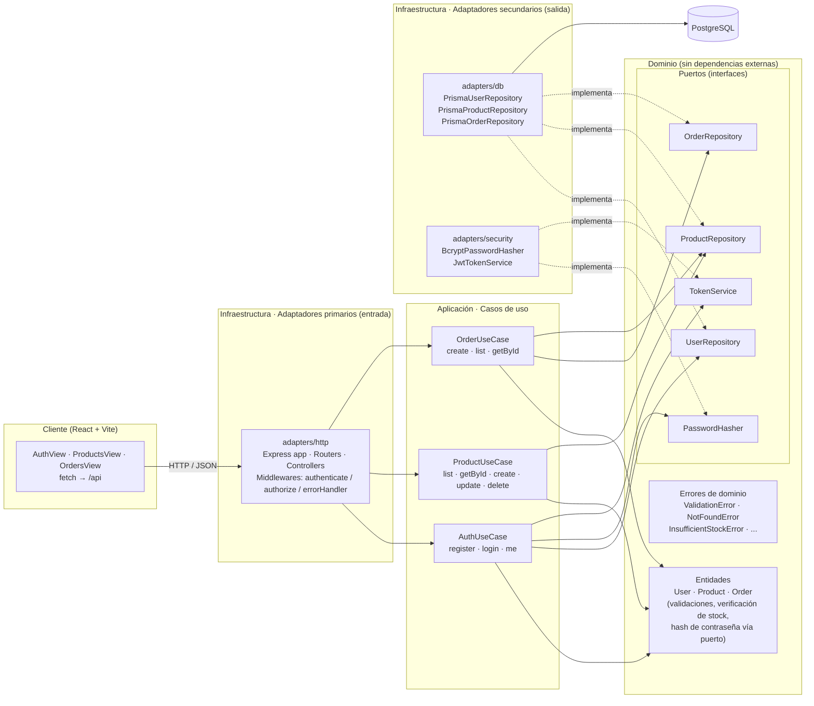

# E-commerce Práctica — Arquitectura Hexagonal

E-commerce minimalista para práctica universitaria.

- **Backend** (`/server`): Node.js + Express + Prisma ORM (PostgreSQL) + bcryptjs + JWT + cors.
- **Frontend** (`/client`): React + Vite + CSS plano, conectado a la API con `fetch`.

**Repositorio:** https://github.com/Rorre12/ecommerce-practica

## Documentación

| Documento | Contenido |
|-----------|-----------|
| [docs/README.md](docs/README.md) | Índice general |
| [docs/arquitectura.md](docs/arquitectura.md) | Capas hexagonales, puertos, adaptadores y flujo de una petición |
| [docs/api.md](docs/api.md) | Referencia completa de la API REST con ejemplos |
| [docs/base-de-datos.md](docs/base-de-datos.md) | Modelo de datos, diagrama ER, migraciones y seed |
| [docs/frontend.md](docs/frontend.md) | Módulos de la SPA y cliente HTTP |
| [docs/instalacion.md](docs/instalacion.md) | Variables de entorno, ejecución local, producción y problemas frecuentes |

---

## 1. Diagrama arquitectónico (Hexagonal / Puertos y Adaptadores)



**Regla de dependencias:** las flechas apuntan siempre hacia el dominio. El dominio no importa Express, Prisma ni bcrypt; solo define puertos. `src/index.js` es la **raíz de composición**, el único lugar donde se instancian los adaptadores concretos y se inyectan en los casos de uso.

Versión en texto:

```
          ┌──────────────────── Infraestructura ────────────────────┐
          │  adapters/http (Express)       adapters/db (Prisma)     │
 React ──►│  Routers → Controllers         adapters/security        │──► PostgreSQL
          │        │                       (bcryptjs, JWT)          │
          └────────┼──────────────────────────────▲─────────────────┘
                   ▼                              │ implementa
          ┌──────── Aplicación ────────┐   ┌──────┴──── Puertos ────────┐
          │ AuthUseCase                │──►│ UserRepository             │
          │ ProductUseCase             │   │ ProductRepository          │
          │ OrderUseCase               │   │ OrderRepository            │
          └────────┬───────────────────┘   │ PasswordHasher/TokenService│
                   ▼                       └────────────────────────────┘
          ┌──────── Dominio ───────────┐
          │ User · Product · Order     │
          │ Errores de dominio         │
          └────────────────────────────┘
```

---

## 2. Estructura del proyecto

```
ecommerce-practica/
├── docker-compose.yml            # PostgreSQL local (opcional)
├── README.md
├── docs/                         # Documentación técnica detallada
├── server/
│   ├── .env.example
│   ├── package.json
│   ├── prisma/
│   │   ├── schema.prisma         # User, Product, Order, OrderItem
│   │   └── seed.js               # Admin + productos de ejemplo
│   └── src/
│       ├── index.js              # Raíz de composición (inyección de dependencias)
│       ├── domain/
│       │   ├── errors.js
│       │   ├── entities/         # User.js · Product.js · Order.js
│       │   └── ports/            # UserRepository · ProductRepository · OrderRepository
│       │                         # PasswordHasher · TokenService
│       ├── application/          # AuthUseCase · ProductUseCase · OrderUseCase
│       └── infrastructure/
│           └── adapters/
│               ├── http/         # app.js · routes/ · controllers/ · middlewares/
│               ├── db/           # prismaClient · Prisma*Repository
│               └── security/     # BcryptPasswordHasher · JwtTokenService
└── client/
    ├── .env.example
    ├── index.html
    ├── package.json
    ├── vite.config.js            # Proxy /api → http://localhost:4000
    └── src/
        ├── main.jsx · App.jsx · api.js · format.js · styles.css
        └── modules/
            ├── auth/AuthView.jsx
            ├── products/ProductsView.jsx
            └── orders/OrdersView.jsx
```

---

## 3. Modelo de datos (Prisma / PostgreSQL)

| Entidad     | Campos                                               |
|-------------|------------------------------------------------------|
| `User`      | id, email (único), password (hash bcrypt), role (`ADMIN` \| `CUSTOMER`), createdAt |
| `Product`   | id, name, price (Decimal 10,2), stock, createdAt, updatedAt |
| `Order`     | id, userId → User, total (Decimal 12,2), createdAt   |
| `OrderItem` | id, orderId → Order, productId → Product, quantity, price (precio congelado al comprar) |

---

## 4. Especificación de endpoints

Base URL: `http://localhost:4000/api`

Autenticación: header `Authorization: Bearer <token>` (JWT devuelto en login/registro).

Formato de error: `{ "error": { "code": "VALIDATION_ERROR", "message": "...", "details": ... } }`

### Salud

| Método | Ruta          | Auth | Descripción                  |
|--------|---------------|------|------------------------------|
| GET    | `/api/health` | —    | Verifica que la API responde |

### Auth

| Método | Ruta                 | Auth   | Body                      | Respuesta                  |
|--------|----------------------|--------|---------------------------|----------------------------|
| POST   | `/api/auth/register` | —      | `{ "email", "password" }` | `201 { user, token }` (siempre rol `CUSTOMER`) |
| POST   | `/api/auth/login`    | —      | `{ "email", "password" }` | `200 { user, token }`      |
| GET    | `/api/auth/me`       | Bearer | —                         | `200 { id, email, role, createdAt }` |

### Productos

| Método | Ruta                 | Auth          | Body                              | Respuesta         |
|--------|----------------------|---------------|-----------------------------------|-------------------|
| GET    | `/api/products`      | —             | —                                 | `200 Product[]`   |
| GET    | `/api/products/:id`  | —             | —                                 | `200 Product`     |
| POST   | `/api/products`      | Bearer ADMIN  | `{ "name", "price", "stock" }`    | `201 Product`     |
| PUT    | `/api/products/:id`  | Bearer ADMIN  | `{ "name"?, "price"?, "stock"? }` | `200 Product`     |
| DELETE | `/api/products/:id`  | Bearer ADMIN  | —                                 | `204` (`409` si el producto tiene pedidos) |

### Pedidos

| Método | Ruta               | Auth   | Body                                                   | Respuesta |
|--------|--------------------|--------|--------------------------------------------------------|-----------|
| POST   | `/api/orders`      | Bearer | `{ "items": [ { "productId": 1, "quantity": 2 } ] }`   | `201 Order` (`409 INSUFFICIENT_STOCK` si no hay stock) |
| GET    | `/api/orders`      | Bearer | —                                                      | `200 Order[]` (ADMIN: todos · CUSTOMER: solo los suyos) |
| GET    | `/api/orders/:id`  | Bearer | —                                                      | `200 Order` (`404` si no es tuyo) |

Ejemplo de `Order`:

```json
{
  "id": 1,
  "userId": 2,
  "userEmail": "cliente@correo.com",
  "total": 139.3,
  "createdAt": "2026-09-23T15:00:00.000Z",
  "items": [
    { "id": 1, "productId": 1, "productName": "Teclado mecánico", "quantity": 2, "price": 59.9 },
    { "id": 2, "productId": 2, "productName": "Mouse inalámbrico", "quantity": 1, "price": 19.5 }
  ]
}
```

### Códigos de estado

| Código de dominio    | HTTP |
|----------------------|------|
| `VALIDATION_ERROR`   | 400  |
| `UNAUTHORIZED`       | 401  |
| `FORBIDDEN`          | 403  |
| `NOT_FOUND`          | 404  |
| `CONFLICT`           | 409  |
| `INSUFFICIENT_STOCK` | 409  |

---

## 5. Reglas de negocio implementadas

- Las contraseñas se hashean con **bcryptjs** (a través del puerto `PasswordHasher`); nunca se devuelven en la API.
- El registro público crea siempre usuarios `CUSTOMER`. El `ADMIN` inicial lo crea el seed (`npm run seed`).
- Solo `ADMIN` puede crear, editar o eliminar productos.
- Al crear un pedido:
  1. El dominio (`Order.create` → `Product.assertStock`) valida cantidades y stock.
  2. El repositorio descuenta el stock **dentro de una transacción** con un `UPDATE ... WHERE stock >= cantidad`, así dos pedidos simultáneos no pueden dejar stock negativo.
  3. El precio de cada línea queda congelado en `OrderItem.price`, y el total se calcula en centavos para evitar errores de coma flotante.

---

## 6. Puesta en marcha

Requisitos: Node.js 18+ y PostgreSQL 14+ (o Docker).

```powershell
# 1) Base de datos (opcional si ya tienes PostgreSQL instalado)
cd C:\taller3\ecommerce-practica
docker compose up -d

# 2) Backend
cd C:\taller3\ecommerce-practica\server
copy .env.example .env          # ajusta DATABASE_URL y JWT_SECRET
npm install
npx prisma migrate dev --name init
npm run seed                    # crea admin@tienda.com / Admin123! y productos de ejemplo
npm run dev                     # http://localhost:4000

# 3) Frontend (otra terminal)
cd C:\taller3\ecommerce-practica\client
npm install
npm run dev                     # http://localhost:5173
```

En producción: `npm run prisma:deploy && npm start` en `/server`, y `npm run build` en `/client` (con `VITE_API_URL` apuntando a la API pública y `CORS_ORIGIN` configurado en el backend).

### Prueba rápida con curl

```bash
curl -X POST http://localhost:4000/api/auth/login -H "Content-Type: application/json" \
  -d '{"email":"admin@tienda.com","password":"Admin123!"}'

curl http://localhost:4000/api/products

curl -X POST http://localhost:4000/api/orders -H "Content-Type: application/json" \
  -H "Authorization: Bearer <TOKEN>" -d '{"items":[{"productId":1,"quantity":2}]}'
```

---

## 7. Subir el repositorio a GitHub

Primero crea un repositorio **vacío** en GitHub (sin README ni .gitignore) y reemplaza la URL.

**PowerShell:**

```powershell
Set-Location C:\taller3\ecommerce-practica
$RepoUrl = "https://github.com/Rorre12/ecommerce-practica.git"

git init
git add .
git commit -m "feat: e-commerce minimalista con arquitectura hexagonal (Express + Prisma + React)"
git branch -M main
git remote add origin $RepoUrl
git push -u origin main
```

**Bash (Git Bash):**

```bash
cd /c/taller3/ecommerce-practica
REPO_URL="https://github.com/Rorre12/ecommerce-practica.git"

git init
git add .
git commit -m "feat: e-commerce minimalista con arquitectura hexagonal (Express + Prisma + React)"
git branch -M main
git remote add origin "$REPO_URL"
git push -u origin main
```

**Alternativa con GitHub CLI** (crea el repo remoto y hace push en un paso):

```powershell
gh repo create ecommerce-practica --public --source . --remote origin --push
```

> El `.gitignore` excluye `node_modules/` y los archivos `.env`, así que no se suben secretos.
