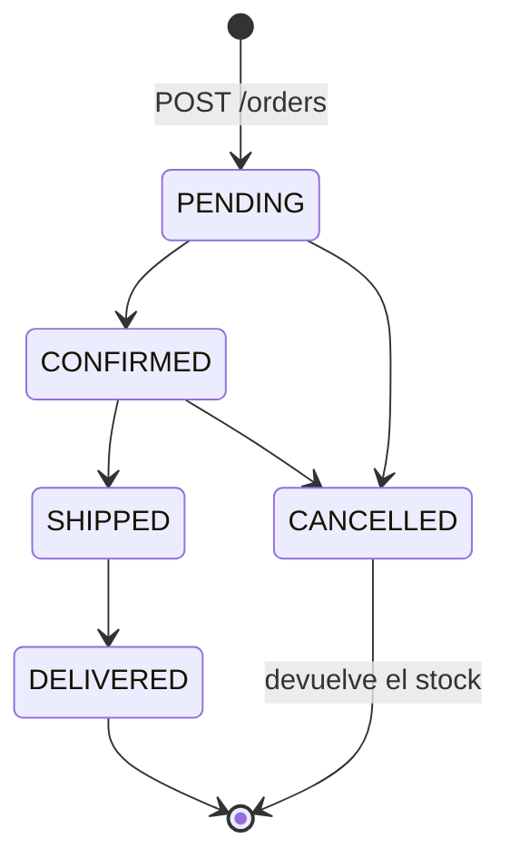

# API REST

Repositorio: https://github.com/Rorre12/ecommerce-practica

- **Base URL:** `http://localhost:4000/api`
- **Formato:** JSON (`Content-Type: application/json`)
- **Autenticación:** `Authorization: Bearer <token>`. El token se obtiene en `/auth/register` o `/auth/login` y expira según `JWT_EXPIRES_IN` (8 h por defecto).
- **Permisos vigentes:** el middleware `authenticate` recarga al usuario desde la base de datos en cada petición. Si el admin cambia sus permisos o revoca su acceso, aplica en la siguiente petición aunque el token siga vigente.

## Niveles de acceso

| Nivel | Quién |
|-------|-------|
| Público | Cualquiera, sin token |
| Sesión | Cualquier usuario con token y acceso activo (comprador en adelante) |
| Permiso `PRODUCTS` / `ORDERS` | Usuarios a los que el admin les dio ese permiso, o el admin |
| Admin | Solo `role = ADMIN` |

## Resumen de endpoints

| Método | Ruta | Acceso | Descripción |
|--------|------|--------|-------------|
| GET | `/api/health` | Público | Estado de la API |
| POST | `/api/auth/register` | Público | Crear cuenta de comprador e iniciar sesión |
| POST | `/api/auth/login` | Público | Iniciar sesión |
| GET | `/api/auth/me` | Sesión | Usuario autenticado con sus permisos |
| GET | `/api/products` | Público | Listar productos |
| GET | `/api/products/:id` | Público | Obtener producto |
| POST | `/api/products` | `PRODUCTS` | Crear producto |
| PUT | `/api/products/:id` | `PRODUCTS` | Editar producto |
| DELETE | `/api/products/:id` | `PRODUCTS` | Eliminar producto |
| POST | `/api/orders` | Sesión | Crear pedido |
| GET | `/api/orders` | Sesión | Pedidos propios |
| GET | `/api/orders?scope=all` | `ORDERS` | Todos los pedidos |
| GET | `/api/orders/:id` | Dueño o `ORDERS` | Obtener pedido |
| PATCH | `/api/orders/:id/status` | `ORDERS` | Cambiar el estado de un pedido |
| GET | `/api/users` | Admin | Listar usuarios (filtro opcional `?status=`) |
| PATCH | `/api/users/:id` | Admin | Cambiar permisos y/o estado de acceso |

## Errores

Todas las respuestas de error usan el mismo formato:

```json
{ "error": { "code": "VALIDATION_ERROR", "message": "Email inválido", "details": ["Email inválido"] } }
```

| `code` | HTTP | Cuándo ocurre |
|--------|------|---------------|
| `VALIDATION_ERROR` | 400 | Datos inválidos (email, contraseña, precio, stock, unidad, categoría, cantidad, id, permiso, transición de estado) |
| `INVALID_JSON` | 400 | El cuerpo no es JSON válido |
| `UNAUTHORIZED` | 401 | Falta el token, token inválido/expirado o credenciales incorrectas |
| `FORBIDDEN` | 403 | Falta el permiso necesario, o el acceso de la cuenta fue revocado |
| `NOT_FOUND` | 404 | Recurso o ruta inexistente; pedido de otro usuario |
| `CONFLICT` | 409 | Email ya registrado; eliminar producto con pedidos; pedido modificado por otro usuario |
| `INSUFFICIENT_STOCK` | 409 | La cantidad pedida supera el stock |
| `INTERNAL_ERROR` | 500 | Error inesperado del servidor |

---

## Auth

Modelo público de usuario (nunca incluye la contraseña):

```json
{
  "id": 7,
  "email": "cliente@correo.com",
  "role": "CUSTOMER",
  "status": "APPROVED",
  "permissions": [],
  "createdAt": "2026-09-24T18:08:00.000Z"
}
```

`permissions` puede contener `PRODUCTS` y/o `ORDERS`. Para el admin se devuelven siempre todos.

### `POST /api/auth/register`

Crea un comprador (`CUSTOMER`, `APPROVED`, sin permisos de gestión) y abre sesión de inmediato.

```json
// Request
{ "email": "cliente@correo.com", "password": "secreto123" }

// 201 Created
{ "user": { "id": 7, "email": "cliente@correo.com", "role": "CUSTOMER", "status": "APPROVED", "permissions": [], "createdAt": "..." },
  "token": "eyJhbGciOiJIUzI1NiIs..." }
```

Errores: `400` email inválido o contraseña fuera de 6–72 caracteres · `409` email ya registrado.

### `POST /api/auth/login`

```json
// Request
{ "email": "admin@tienda.com", "password": "Admin123!" }

// 200 OK
{ "user": { "id": 1, "email": "admin@tienda.com", "role": "ADMIN", "status": "APPROVED", "permissions": ["PRODUCTS", "ORDERS"], "createdAt": "..." },
  "token": "..." }
```

Errores: `401` credenciales inválidas · `403` "Tu acceso fue revocado por el administrador".

### `GET /api/auth/me`

Devuelve el usuario con los permisos vigentes. El frontend lo llama al cargar para refrescar las pantallas visibles.

---

## Productos

Modelo:

```json
{ "id": 5, "name": "Cemento gris 50 kg", "price": 9.5, "stock": 200, "unit": "saco", "category": "Cementos y morteros" }
```

Validaciones: `name` obligatorio (máx. 120) · `price` número ≥ 0, redondeado a 2 decimales · `stock` entero ≥ 0 · `unit` obligatorio (máx. 20, por defecto `unidad`) · `category` obligatoria (máx. 60, por defecto `General`).

### `GET /api/products` → `200 Product[]`

Ordenados por categoría y nombre.

### `GET /api/products/:id` → `200 Product` · `404`

### `POST /api/products` (permiso `PRODUCTS`)

```json
// Request
{ "name": "Varilla corrugada 3/8\" x 12 m", "price": 7.9, "stock": 500, "unit": "varilla", "category": "Acero" }
// 201 Created → Product
```

### `PUT /api/products/:id` (permiso `PRODUCTS`)

Actualización parcial: se envían solo los campos que cambian.

```json
// Request
{ "price": 8.2, "stock": 480 }
// 200 OK → Product
```

### `DELETE /api/products/:id` (permiso `PRODUCTS`)

`204 No Content` · `404` si no existe · `409` si el producto ya forma parte de algún pedido.

---

## Pedidos

Modelo:

```json
{
  "id": 12,
  "userId": 7,
  "userEmail": "cliente@correo.com",
  "total": 553.5,
  "status": "PENDING",
  "nextStatuses": ["CONFIRMED", "CANCELLED"],
  "createdAt": "2026-09-24T18:10:00.000Z",
  "items": [
    { "id": 20, "productId": 5, "productName": "Cemento gris 50 kg", "unit": "saco", "quantity": 25, "price": 9.5 },
    { "id": 21, "productId": 10, "productName": "Varilla corrugada 3/8\" x 12 m", "unit": "varilla", "quantity": 40, "price": 7.9 }
  ]
}
```

`nextStatuses` indica a qué estados puede pasar el pedido. El frontend lo usa para mostrar solo las acciones válidas.

### Ciclo de vida



### `POST /api/orders` (sesión)

Si un `productId` aparece varias veces, se suman las cantidades. El stock se descuenta dentro de una transacción.

```json
// Request
{ "items": [ { "productId": 5, "quantity": 25 }, { "productId": 10, "quantity": 40 } ] }
// 201 Created → Order (status PENDING)
```

Errores: `400` lista vacía o cantidad inválida · `404` producto inexistente · `409 INSUFFICIENT_STOCK`.

### `GET /api/orders` → `200 Order[]`

Pedidos del usuario autenticado, del más reciente al más antiguo. Con `?scope=all` devuelve los de todos los usuarios (requiere `ORDERS`; sin él responde `403`).

### `GET /api/orders/:id` → `200 Order`

Devuelve `404` si el pedido no existe, o si pertenece a otro usuario y quien consulta no tiene `ORDERS`.

### `PATCH /api/orders/:id/status` (permiso `ORDERS`)

```json
// Request
{ "status": "CONFIRMED" }
// 200 OK → Order con el nuevo estado y sus nextStatuses
```

Errores: `400` estado inválido o transición no permitida (p. ej. `CONFIRMED → DELIVERED`) · `404` · `409` si otro usuario cambió el pedido antes.

---

## Usuarios (solo admin)

### `GET /api/users` → `200 User[]`

Del más reciente al más antiguo. Filtro opcional: `?status=APPROVED | REJECTED | PENDING`.

### `PATCH /api/users/:id`

Cambia permisos, estado de acceso o ambos.

```json
// Dar acceso a la gestión de pedidos
{ "permissions": ["ORDERS"] }

// Quitar todos los permisos (vuelve a comprador)
{ "permissions": [] }

// Revocar el acceso / reactivarlo
{ "status": "REJECTED" }
{ "status": "APPROVED" }
```

Respuesta: `200 User`. Errores: `400` permiso o estado inválido, o intento de modificar a un administrador · `404` usuario inexistente.

---

## Ejemplos con curl

```bash
API=http://localhost:4000/api

# Admin: iniciar sesión y guardar el token (Git Bash)
ADMIN=$(curl -s -X POST $API/auth/login -H "Content-Type: application/json" \
  -d '{"email":"admin@tienda.com","password":"Admin123!"}' | sed -E 's/.*"token":"([^"]+)".*/\1/')

# Cliente: crear cuenta (devuelve el token directamente)
curl -s -X POST $API/auth/register -H "Content-Type: application/json" \
  -d '{"email":"obra@correo.com","password":"secreto123"}'

# Admin: dar permiso de pedidos al usuario 7
curl -X PATCH $API/users/7 -H "Authorization: Bearer $ADMIN" -H "Content-Type: application/json" \
  -d '{"permissions":["ORDERS"]}'

# Crear pedido
curl -X POST $API/orders -H "Authorization: Bearer $ADMIN" -H "Content-Type: application/json" \
  -d '{"items":[{"productId":5,"quantity":10}]}'

# Confirmar el pedido 12
curl -X PATCH $API/orders/12/status -H "Authorization: Bearer $ADMIN" -H "Content-Type: application/json" \
  -d '{"status":"CONFIRMED"}'
```
