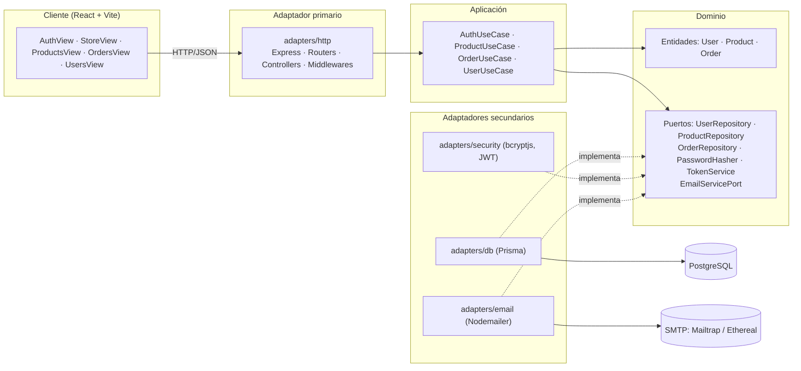
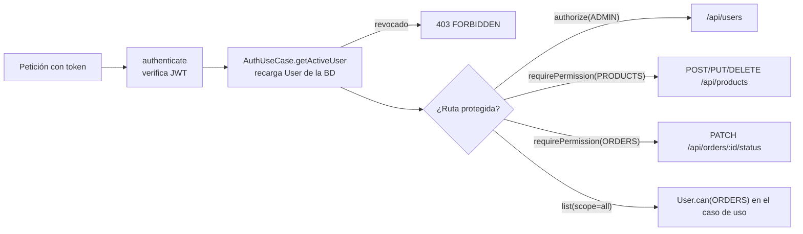

# Arquitectura

Repositorio: https://github.com/Rorre12/ecommerce-practica

El backend sigue la **arquitectura hexagonal** (puertos y adaptadores). El objetivo es que las reglas de negocio no dependan de Express, Prisma ni bcrypt: esas tecnologías son detalles intercambiables conectados en los bordes.

## Diagrama



## Capas

### 1. Dominio — `server/src/domain`

Código JavaScript puro, sin dependencias de librerías.

| Archivo | Responsabilidad |
|---------|-----------------|
| `entities/User.js` | Valida email y contraseña (6–72 caracteres), normaliza el email y hashea la contraseña a través del puerto `PasswordHasher`. Define `ROLES`, `USER_STATUS` y `PERMISSIONS`. Reglas: `can(permiso)` (el admin los tiene todos), `assertCanAccess()` (bloquea cuentas revocadas) y `review()` (aplica permisos o estado, nunca a un admin). `toPublic()` omite el hash. |
| `entities/Product.js` | Valida nombre, precio, stock, unidad de venta y categoría; `update()` devuelve una nueva instancia validada; `assertStock()` lanza `InsufficientStockError`. |
| `entities/Order.js` | `Order.create()` valida cantidades, verifica stock, congela precios y calcula el total en centavos. Define `ORDER_STATUS` y la tabla de transiciones; `assertCanChangeTo()` rechaza transiciones inválidas y `nextStatuses()` expone las permitidas. |
| `errors.js` | Errores de dominio con un `code` (`VALIDATION_ERROR`, `NOT_FOUND`, `CONFLICT`, `UNAUTHORIZED`, `FORBIDDEN`, `INSUFFICIENT_STOCK`). No conocen códigos HTTP. |
| `ports/*.js` | Interfaces (clases base) que la infraestructura debe implementar. |

### 2. Aplicación — `server/src/application`

Orquestan el dominio y los puertos. Reciben sus dependencias por constructor.

| Caso de uso | Operaciones |
|-------------|-------------|
| `AuthUseCase` | `register` (crea comprador activo y devuelve sesión), `login`, `me`, `getActiveUser` (lo usa el middleware en cada petición) |
| `ProductUseCase` | `list`, `getById`, `create`, `update`, `delete` |
| `OrderUseCase` | `create` (agrupa productos repetidos, valida existencia y stock), `list` (propios, o todos con permiso `ORDERS`), `getById` (dueño o `ORDERS`), `changeStatus` |
| `UserUseCase` | `list` (filtro por estado), `review` (permisos y estado de acceso) |

### 3. Infraestructura — `server/src/infrastructure/adapters`

| Adaptador | Tipo | Implementa |
|-----------|------|------------|
| `http/` | Primario (entrada) | Traduce HTTP ↔ casos de uso. `authenticate` verifica el JWT y recarga el usuario; `authorize(rol)` y `requirePermission(permiso)` protegen rutas; `errorHandler` convierte `code` de dominio en status HTTP. |
| `db/PrismaUserRepository.js` | Secundario | `UserRepository` (`findAll`, `save`, `update` de estado y permisos) |
| `db/PrismaProductRepository.js` | Secundario | `ProductRepository` (traduce errores Prisma `P2003`/`P2025` a errores de dominio) |
| `db/PrismaOrderRepository.js` | Secundario | `OrderRepository` (transacción + descuento atómico de stock; `updateStatus` condicionado al estado leído y devolución de stock al cancelar) |
| `security/BcryptPasswordHasher.js` | Secundario | `PasswordHasher` |
| `security/JwtTokenService.js` | Secundario | `TokenService` |

### 4. Raíz de composición — `server/src/index.js`

Único lugar que conoce las clases concretas: crea los adaptadores, los inyecta en los casos de uso y arranca Express. Cambiar Prisma por otro ORM o bcrypt por argon2 solo toca este archivo y el adaptador nuevo.

## Flujo de una petición: `POST /api/orders`

```mermaid
sequenceDiagram
    participant C as Cliente
    participant H as HTTP (authenticate + OrderController)
    participant U as OrderUseCase
    participant D as Dominio (Order/Product)
    participant R as PrismaOrderRepository
    participant DB as PostgreSQL
    participant M as NodemailerEmailAdapter

    C->>H: POST /api/orders { items } + Bearer token
    H->>H: verifica JWT y recarga el usuario (permisos vigentes) → req.user
    H->>U: create(userId, items)
    U->>R: productRepository.findByIds(ids)
    R->>DB: SELECT products
    U->>D: Order.create(userId, lines)
    D->>D: valida cantidades, assertStock, calcula total
    U->>R: orderRepository.create(order)
    R->>DB: BEGIN; UPDATE stock WHERE stock >= qty; INSERT order + items; COMMIT
    R-->>U: Order (PENDING = pendiente de pago)
    U->>D: PaymentInstructions.forOrder(order, cuenta)
    U->>M: emailService.sendOrderConfirmation(order, payment)
    U->>M: emailService.sendNewOrderAlert(order, payment)
    M-->>U: ok / error (no revierte el pedido)
    U-->>H: Order + payment + notifications
    H-->>C: 201
```

## Autorización: dónde vive cada regla



La decisión de si un usuario puede hacer algo la toma siempre la entidad `User` (`can`, `assertCanAccess`, `review`). Los middlewares y los casos de uso solo la consultan.

## Reglas de dependencia

- `domain` no importa nada de `application` ni `infrastructure`.
- `application` importa solo de `domain`.
- `infrastructure` importa de `domain` (para implementar puertos) y de `application` (solo tipos en JSDoc).
