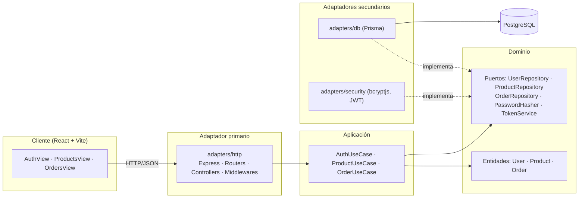

# Arquitectura

Repositorio: https://github.com/Rorre12/ecommerce-practica

El backend sigue la **arquitectura hexagonal** (puertos y adaptadores). El objetivo es que las reglas de negocio no dependan de Express, Prisma ni bcrypt: esas tecnologías son detalles intercambiables conectados en los bordes.

## Diagrama



## Capas

### 1. Dominio — `server/src/domain`

Código JavaScript puro, sin dependencias de librerías.

| Archivo | Responsabilidad |
|---------|-----------------|
| `entities/User.js` | Valida email y contraseña (6–72 caracteres), normaliza el email, hashea la contraseña a través del puerto `PasswordHasher`, expone `toPublic()` sin el hash. Define `ROLES`. |
| `entities/Product.js` | Valida nombre, precio y stock; `update()` devuelve una nueva instancia validada; `assertStock()` lanza `InsufficientStockError`. |
| `entities/Order.js` | `Order.create()` valida cantidades, verifica stock de cada producto, congela precios y calcula el total en centavos. |
| `errors.js` | Errores de dominio con un `code` (`VALIDATION_ERROR`, `NOT_FOUND`, `CONFLICT`, `UNAUTHORIZED`, `FORBIDDEN`, `INSUFFICIENT_STOCK`). No conocen códigos HTTP. |
| `ports/*.js` | Interfaces (clases base) que la infraestructura debe implementar. |

### 2. Aplicación — `server/src/application`

Orquestan el dominio y los puertos. Reciben sus dependencias por constructor.

| Caso de uso | Operaciones |
|-------------|-------------|
| `AuthUseCase` | `register`, `login`, `me` |
| `ProductUseCase` | `list`, `getById`, `create`, `update`, `delete` |
| `OrderUseCase` | `create` (agrupa productos repetidos, valida existencia y stock), `list` (según rol), `getById` (solo dueño o admin) |

### 3. Infraestructura — `server/src/infrastructure/adapters`

| Adaptador | Tipo | Implementa |
|-----------|------|------------|
| `http/` | Primario (entrada) | Traduce HTTP ↔ casos de uso. `errorHandler` convierte `code` de dominio en status HTTP. |
| `db/PrismaUserRepository.js` | Secundario | `UserRepository` |
| `db/PrismaProductRepository.js` | Secundario | `ProductRepository` (traduce errores Prisma `P2003`/`P2025` a errores de dominio) |
| `db/PrismaOrderRepository.js` | Secundario | `OrderRepository` (transacción + descuento atómico de stock) |
| `security/BcryptPasswordHasher.js` | Secundario | `PasswordHasher` |
| `security/JwtTokenService.js` | Secundario | `TokenService` |

### 4. Raíz de composición — `server/src/index.js`

Único lugar que conoce las clases concretas: crea los adaptadores, los inyecta en los casos de uso y arranca Express. Cambiar Prisma por otro ORM o bcrypt por argon2 solo toca este archivo y el adaptador nuevo.

## Flujo de una petición: `POST /api/orders`

```mermaid
sequenceDiagram
    participant C as Cliente
    participant H as HTTP (authenticate + OrderController)
    participant U as OrderUseCase
    participant D as Dominio (Order/Product)
    participant R as PrismaOrderRepository
    participant DB as PostgreSQL

    C->>H: POST /api/orders { items } + Bearer token
    H->>H: verifica JWT → req.user
    H->>U: create(userId, items)
    U->>R: productRepository.findByIds(ids)
    R->>DB: SELECT products
    U->>D: Order.create(userId, lines)
    D->>D: valida cantidades, assertStock, calcula total
    U->>R: orderRepository.create(order)
    R->>DB: BEGIN; UPDATE stock WHERE stock >= qty; INSERT order + items; COMMIT
    R-->>H: Order
    H-->>C: 201 Order
```

## Reglas de dependencia

- `domain` no importa nada de `application` ni `infrastructure`.
- `application` importa solo de `domain`.
- `infrastructure` importa de `domain` (para implementar puertos) y de `application` (solo tipos en JSDoc).
