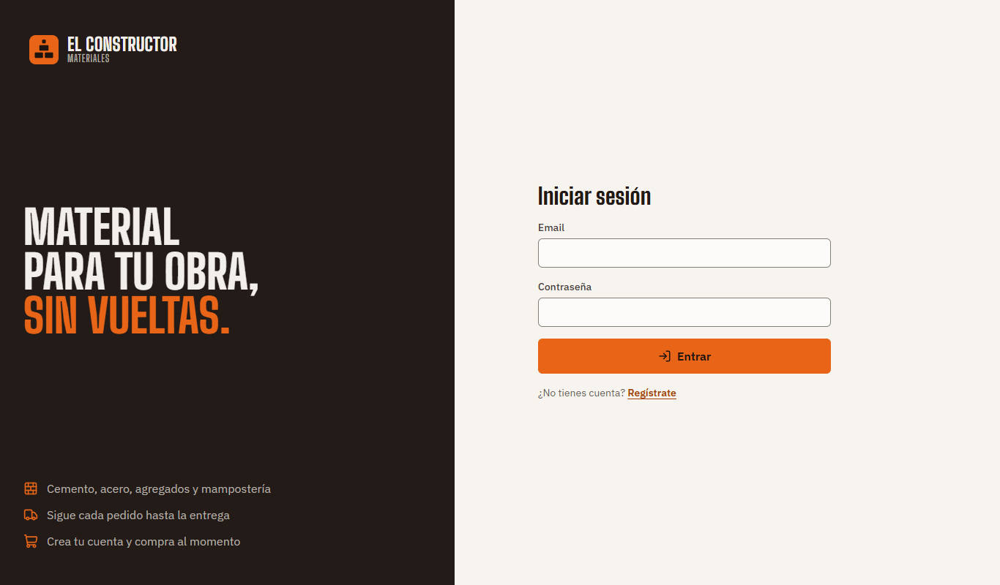
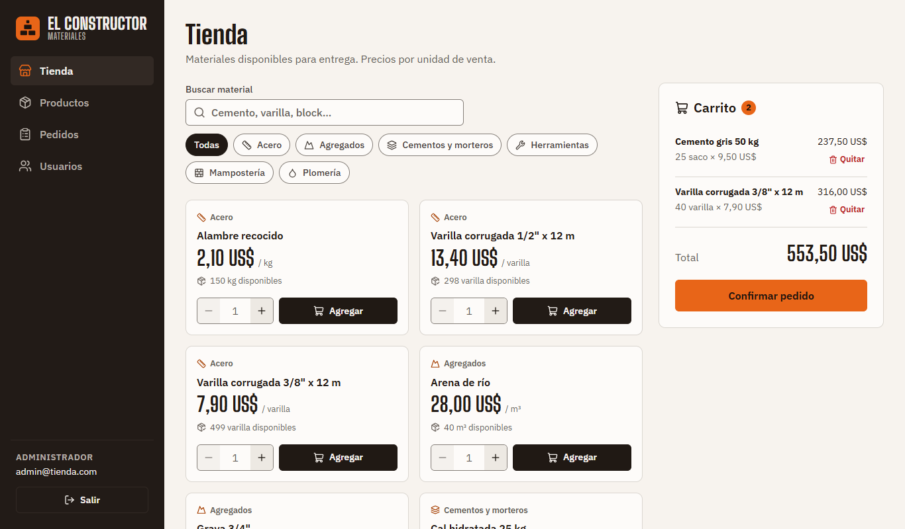
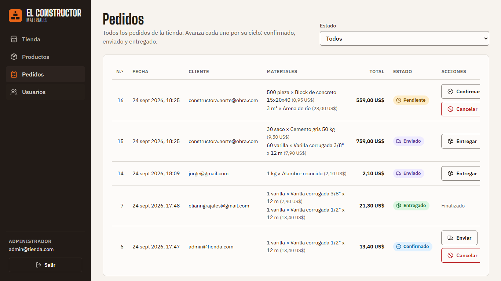
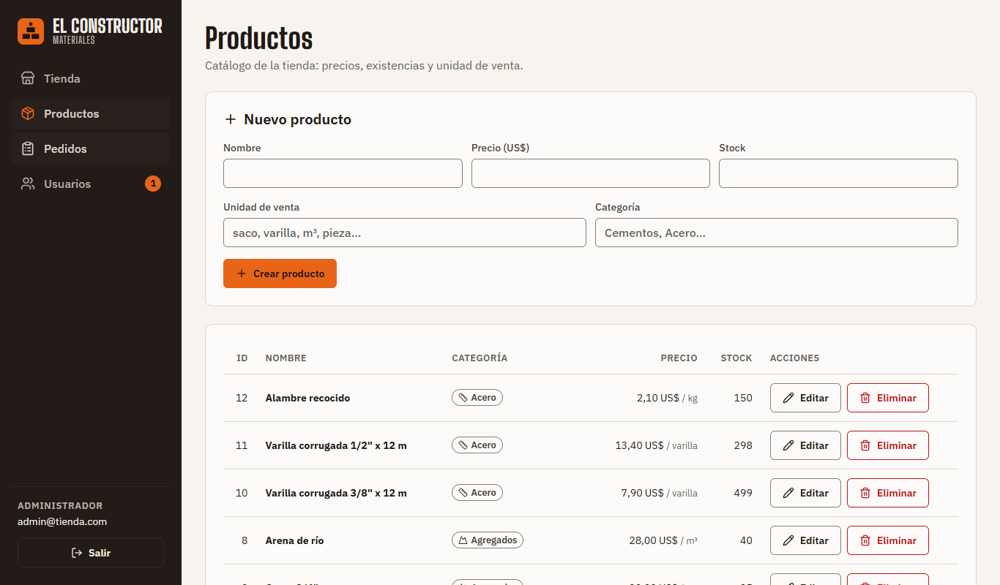
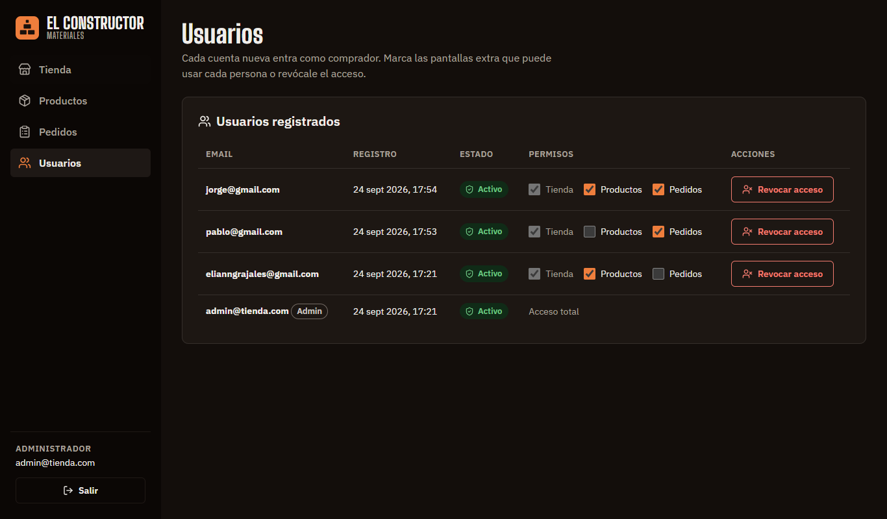
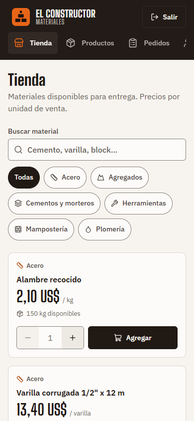

# Auditoría de diseño — Materiales El Constructor

Auditoría visual y de usabilidad del cliente React (`client/`), antes y después del rediseño, usando dos guías de referencia:

| Herramienta | Qué aporta | Cómo se usó |
|---|---|---|
| [UI UX Pro Max](https://uupm.cc/) ([repo](https://github.com/nextlevelbuilder/ui-ux-pro-max-skill)) | Base de datos de estilos, paletas y tipografías por tipo de producto + checklist de UX/accesibilidad | Se ejecutó su buscador (`scripts/search.py`) para el perfil del producto y se aplicó su *Pre-Delivery Checklist* |
| [Hallmark](https://github.com/nutlope/hallmark) | Catálogo de *anti-patrones* que delatan una interfaz genérica, con severidades | Se aplicó su verbo `audit` (`references/verbs/audit.md` + `references/anti-patterns.md`) a mano, con el formato de reporte que define |

Todas las mediciones (contraste, desbordes, áreas táctiles) se tomaron en Chrome con Playwright sobre la app corriendo, no estimadas.

---

## 1. Dirección de diseño (UI UX Pro Max)

La primera búsqueda amplia (`"construction materials hardware ecommerce store" --design-system`) devolvió un perfil de **e-commerce de lujo** (tipografía Cormorant, estilo *Liquid Glass*), que no corresponde a una ferretería. Siguiendo la regla de la propia herramienta (*reintentar una vez con una consulta más acotada*), se consultó por dominio:

| Consulta | Resultado aplicado |
|---|---|
| `"construction industrial" --domain product` | **Construction/Architecture** → estilo *Minimalism & Swiss Style*, paleta "gris + naranja de seguridad + azul plano" |
| `"construction hardware" --domain color` | Gris industrial + acento naranja `#EA580C`, texto oscuro sobre el acento |
| `"industrial construction bold" --domain typography` | Pares tipo *display condensada + sans*; se eligió un par equivalente fuera de la lista prohibida de Hallmark (ver §3) |

## 2. Sistema aplicado

- **Color:** tokens en OKLCH en `client/src/styles.css`. Neutros tintados hacia el naranja (tono 55–70), sin `#000` ni `#fff` puros. Un solo acento (naranja de seguridad), usado solo en la acción principal de cada vista, el indicador de navegación activa, el anillo de foco, los contadores y el logotipo. Azul plano, verde, violeta y rojo solo como colores de **estado**. Modo oscuro automático (`prefers-color-scheme`) con los mismos tokens.
- **Tipografía:** *Big Shoulders Display* (condensada industrial) para títulos, precios y marca; *IBM Plex Sans* (sans de ingeniería) para el texto. Escala de tercera mayor (1.25) sobre 16 px. Cifras tabulares en precios, totales y tablas.
- **Iconos:** una sola librería, [Lucide](https://lucide.dev) (`lucide-react`), en navegación, botones, estados, categorías y mensajes. Todos los iconos decorativos llevan `aria-hidden`, y los botones que solo muestran un icono tienen `aria-label`.
- **Marca:** logotipo SVG propio (bloques apilados), también como favicon.
- **Estructura:** barra lateral de navegación (en lugar de la barra superior genérica) y una pantalla de acceso dividida en dos columnas.

## 3. Auditoría Hallmark — ANTES del rediseño

Formato del verbo `hallmark audit`: *[severidad] anti-patrón — dónde · por qué · corrección*. Las líneas refieren al código previo al rediseño.

### Críticos (se ven como plantilla)

| Anti-patrón | Dónde | Por qué | Corrección aplicada |
|---|---|---|---|
| **The AI nav** | `App.jsx` (header) | Marca a la izquierda, pestañas centradas y usuario a la derecha en una barra de ancho completo: la barra genérica que no dice qué tipo de sitio es | Barra lateral con iconos, marca y bloque de usuario (patrón *N3 side rail*); en móvil pasa a barra superior con navegación deslizable |
| **Inter-everywhere** (una sola fuente) | `styles.css:12` | Solo `system-ui` para títulos y texto | Par *Big Shoulders Display* + *IBM Plex Sans* |
| **Pure black, pure white** | `styles.css:3, 97` (`--surface: #ffffff`, inputs `#fff`) | Superficies planas y sintéticas | Tokens `--paper`/`--surface` tintados (`oklch(96.5% 0.007 70)`, `oklch(99% 0.004 70)`) |
| **Side-stripe card** | `styles.css` `.product-card { border-top: 4px }`, `.notice { border-left: 4px }` | Franja gruesa de color en un solo borde | Borde fino uniforme; los avisos usan fondo suave + borde completo + icono |

### Mayores (parecen generados)

| Anti-patrón | Dónde | Corrección aplicada |
|---|---|---|
| **Accent as background fill** | Todos los botones, la pestaña activa y las franjas en naranja | Botones en tinta (grafito); el acento queda solo para la acción principal de cada vista |
| **Neutros sin tintar** | `#f4f5f7`, `#6b7280` (grises fríos azulados con acento cálido) | Neutros cálidos derivados del tono del acento |
| **Tabular data without tabular-nums** | Precios, stock y totales | `font-variant-numeric: tabular-nums` en tablas, precios y carrito |
| **Mid-render token improvisation** | 17 colores hex sueltos en componentes (`#d1d5db`, `#b91c1c`, estados…) | Todo color pasa por `var(--token)`; verificado con `grep`: 0 valores sueltos |
| **Generic glyph as icon** / sin librería de iconos | Logotipo `▲` (carácter Unicode) | Lucide en toda la app + logotipo SVG propio |

### Menores

| Anti-patrón | Dónde | Corrección aplicada |
|---|---|---|
| Tres puntos en lugar de elipsis | 12 textos (`Cargando...`, `Guardando...`) | `…` (U+2026) |
| Comillas rectas en mensajes | `¿Eliminar "${name}"?` | Comillas tipográficas `“ ”` |
| Texto menor a 12 px | Insignias a `0.7rem` (11,2 px) | Mínimo `0.8rem` (12,8 px) |
| Mismo relleno en todas las secciones | `.card` uniforme | Espaciado por escala (`--space-*`) y encabezados de página con descripción |

**Resumen ANTES — 4 críticos · 5 mayores · 4 menores**
**Veredicto — "ships as slop"** (con 4 críticos, la interfaz se lee como plantilla).

## 4. Checklist UI UX Pro Max — ANTES y DESPUÉS

| Regla (prioridad) | Antes | Después (medido) |
|---|---|---|
| Contraste de texto ≥ 4.5:1 (1 · crítica) | **Falla:** texto blanco sobre botón naranja = **3.19:1** | Peor par de texto: **5.46:1** en claro y **5.85:1** en oscuro (16 pares medidos, todos ≥ 5.4) |
| Límites de controles ≥ 3:1 (WCAG 1.4.11) | No medido | **3.36–3.83:1** (se corrigió desde 2.08:1 durante la verificación) |
| Foco visible con teclado (1 · crítica) | **Falla:** sin estilo de foco en botones | `:focus-visible` con anillo del acento, instantáneo (sin animar) |
| Áreas táctiles ≥ 44 × 44 px (2 · crítica) | **Falla:** botones de ~34 px | **0 controles < 44 px** en pantallas táctiles de 375 y 768 px |
| Feedback en hover, 150–300 ms (2) | Cambios instantáneos | 160 ms con `ease-out`, solo en color/borde (sin `transition: all`) |
| Iconos SVG, no emoji (4) | Carácter `▲` | Lucide + SVG propio |
| Sin scroll horizontal: 375 / 768 / 1024 / 1440 (5) | 519 px de contenido en 390 px durante el rediseño | **0 px de desborde** en 375, 768, 1024, 1366, 1440, 1920 y 2560 px, en las 5 vistas |
| Texto base 16 px, interlineado 1.5 (6) | 16 px / sin definir | 16 px / 1.5 |
| Tokens de color semánticos (6) | Hex sueltos | Tokens OKLCH + modo oscuro |
| `prefers-reduced-motion` (7) | No aplicaba | Respetado (desactiva transiciones y el giro del indicador de carga) |
| Etiquetas visibles, no solo placeholder (8) | Buscador sin etiqueta | Etiqueta visible "Buscar material" |
| Estado no comunicado solo por color | Píldoras con texto | Píldoras con **icono + texto** (pedidos y usuarios) |
| `cursor: pointer` en clicables | Sí | Sí |

## 5. Auditoría Hallmark — DESPUÉS del rediseño

### Críticos
Ninguno.

### Mayores
Ninguno.

### Menores (aceptados, con justificación)

| Anti-patrón | Dónde | Decisión |
|---|---|---|
| Diálogo de confirmación | `ProductsView.jsx` (eliminar), `OrdersView.jsx` (cancelar) | Hallmark lo desaconseja para acciones **reversibles**; aquí ambas son irreversibles (se borra el producto; cancelar es un estado final que devuelve stock). Se mantiene el `confirm` nativo |
| Mensaje de éxito visible | "Producto creado", "Pedido #N: Confirmado" | Son acciones asíncronas y el mensaje confirma el resultado del servidor; se anuncian con `role="status"` |
| Comillas rectas como marca de pulgadas | Datos del seed (`Grava 3/4"`) | Es la notación habitual en ferreterías; es contenido, no texto de interfaz |
| Color fijo en el favicon | `client/public/favicon.svg` | Un favicon estático no puede leer variables CSS; en la app el logotipo sí usa los tokens |

**Resumen DESPUÉS — 0 críticos · 0 mayores · 4 menores (aceptados)**
**Veredicto — "close, fix the minors"**, con los cuatro menores justificados arriba.

## 6. Problemas detectados durante la verificación

La verificación en navegador encontró problemas que el código por sí solo no mostraba. Todos se corrigieron:

1. **Desborde horizontal en móvil:** `grid-template-columns: 1fr` tiene como mínimo el ancho del contenido, y la navegación ensanchaba la página a 519 px. Se corrigió con `minmax(0, 1fr)`.
2. **Filas de tabla desalineadas:** la clase `.actions` (flex) se aplicaba a un `<td>`. Se corrigió con un contenedor interno.
3. **Botón recortado en la tabla de pedidos:** etiquetas acortadas ("Marcar enviado" → "Enviar"), la regla de Hallmark contra botones partidos en dos líneas.
4. **Reglas táctiles sin efecto:** el bloque `@media (pointer: coarse)` estaba antes que las reglas base y perdía en la cascada. Se movió al final.
5. **Selector de cantidad comprimido** a 768 px (botones de 27 px): se fijó su ancho y el mínimo de la tarjeta subió a 272 px.
6. **Contador del carrito engañoso:** sumaba unidades distintas (25 sacos + 40 varillas = "65"). Ahora cuenta productos distintos.

## 7. Capturas

| | |
|---|---|
|  Acceso |  Tienda con carrito |
|  Gestión de pedidos |  Gestión de productos |
|  Usuarios (modo oscuro) |  Móvil, 390 px |
