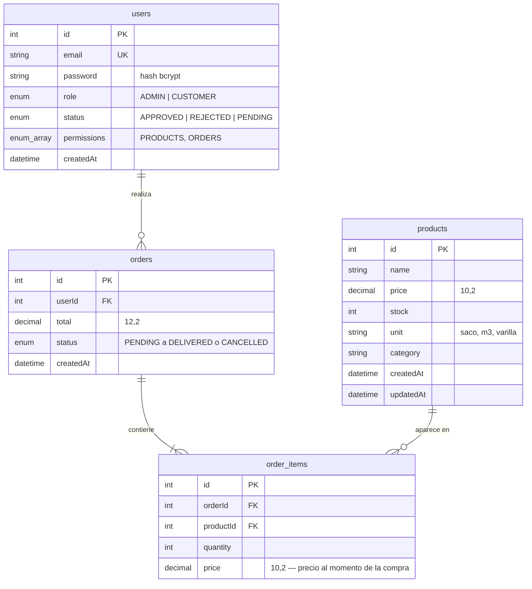

# Base de datos

Repositorio: https://github.com/Rorre12/ecommerce-practica

Motor: **PostgreSQL**, gestionado con **Prisma ORM 5**. Esquema en `server/prisma/schema.prisma`.

## Diagrama entidad-relación

## Tablas

| Modelo Prisma | Tabla | Notas |
|---------------|-------|-------|
| `User` | `users` | `email` único; `role` (`Role`, por defecto `CUSTOMER`); `status` (`UserStatus`, por defecto `APPROVED`, con índice); `permissions` (lista de `Permission`, por defecto vacía) |
| `Product` | `products` | `price` como `Decimal(10,2)` para evitar errores de coma flotante; `unit` (por defecto `unidad`) y `category` (por defecto `General`) |
| `Order` | `orders` | Índice en `userId`; `status` (`OrderStatus`, por defecto `PENDING`) |
| `OrderItem` | `order_items` | `onDelete: Cascade` desde `Order`; `onDelete: Restrict` desde `Product` (no se borra un producto con ventas) |

## Decisiones

- **Precio congelado:** `order_items.price` guarda el precio vigente al comprar, así el historial no cambia si luego se edita el producto.
- **Stock atómico:** al crear un pedido se ejecuta, dentro de una transacción, `UPDATE products SET stock = stock - :qty WHERE id = :id AND stock >= :qty`. Si no se actualiza ninguna fila, se lanza `INSUFFICIENT_STOCK` y se revierte todo.
- **Decimal → Number:** los repositorios convierten los `Decimal` de Prisma a `Number` para que el dominio trabaje con tipos nativos.

## Enums

| Enum | Valores | Uso |
|------|---------|-----|
| `Role` | `ADMIN`, `CUSTOMER` | Tipo de cuenta |
| `UserStatus` | `APPROVED`, `REJECTED`, `PENDING` | Acceso: las cuentas nacen `APPROVED`; `REJECTED` es acceso revocado; `PENDING` solo existe por compatibilidad con el flujo anterior |
| `Permission` | `PRODUCTS`, `ORDERS` | Pantallas de gestión que habilita el admin |
| `OrderStatus` | `PENDING`, `CONFIRMED`, `SHIPPED`, `DELIVERED`, `CANCELLED` | Ciclo de vida del pedido |

## Migraciones

| Migración | Cambios |
|-----------|---------|
| `…_init` | Tablas `users`, `products`, `orders`, `order_items` |
| `…_roles_permisos_materiales` | Enums `UserStatus`, `Permission`, `OrderStatus`; columnas `users.status`, `users.permissions`, `products.unit`, `products.category`, `orders.status`; los usuarios existentes conservan el acceso |
| `…_registro_directo` | El valor por defecto de `users.status` pasa a `APPROVED` (registro sin espera) |

## Comandos

Desde `server/`:

| Comando | Qué hace |
|---------|----------|
| `npx prisma migrate dev` | Aplica las migraciones pendientes (desarrollo) |
| `npm run prisma:deploy` | Aplica migraciones existentes (producción) |
| `npm run prisma:generate` | Regenera el cliente Prisma |
| `npm run seed` | Crea o actualiza el admin (`ADMIN_EMAIL` / `ADMIN_PASSWORD`) y carga 12 materiales de construcción si la tabla está vacía |
| `npx prisma studio` | Interfaz web para explorar los datos |
