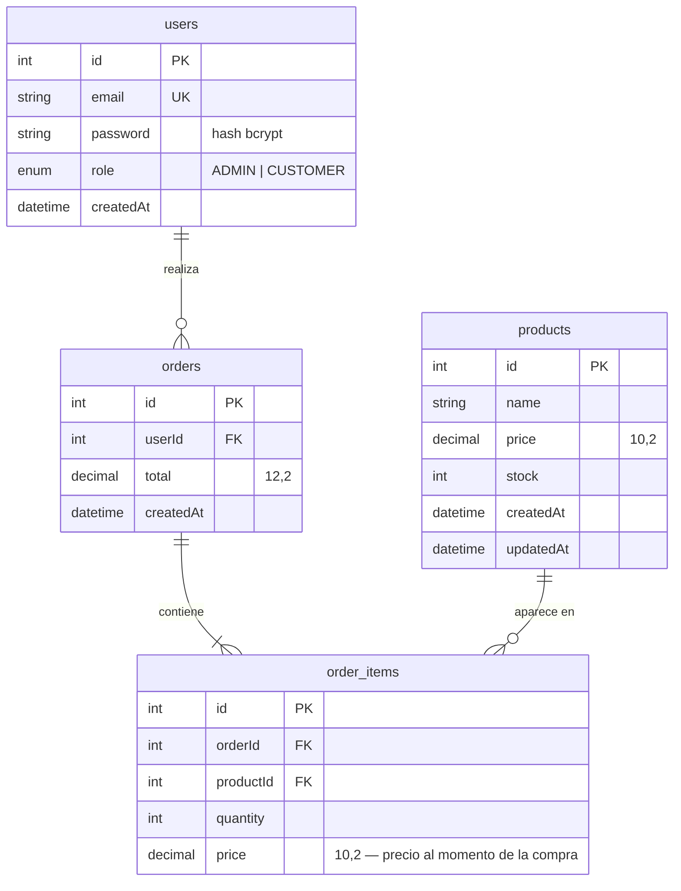

# Base de datos

Repositorio: https://github.com/Rorre12/ecommerce-practica

Motor: **PostgreSQL**, gestionado con **Prisma ORM 5**. Esquema en `server/prisma/schema.prisma`.

## Diagrama entidad-relación

## Tablas

| Modelo Prisma | Tabla | Notas |
|---------------|-------|-------|
| `User` | `users` | `email` único; `role` enum `Role` con valor por defecto `CUSTOMER` |
| `Product` | `products` | `price` como `Decimal(10,2)` para evitar errores de coma flotante |
| `Order` | `orders` | Índice en `userId` |
| `OrderItem` | `order_items` | `onDelete: Cascade` desde `Order`; `onDelete: Restrict` desde `Product` (no se borra un producto con ventas) |

## Decisiones

- **Precio congelado:** `order_items.price` guarda el precio vigente al comprar, así el historial no cambia si luego se edita el producto.
- **Stock atómico:** al crear un pedido se ejecuta, dentro de una transacción, `UPDATE products SET stock = stock - :qty WHERE id = :id AND stock >= :qty`. Si no se actualiza ninguna fila, se lanza `INSUFFICIENT_STOCK` y se revierte todo.
- **Decimal → Number:** los repositorios convierten los `Decimal` de Prisma a `Number` para que el dominio trabaje con tipos nativos.

## Comandos

Desde `server/`:

| Comando | Qué hace |
|---------|----------|
| `npx prisma migrate dev --name init` | Crea la migración inicial y la aplica (desarrollo) |
| `npm run prisma:deploy` | Aplica migraciones existentes (producción) |
| `npm run prisma:generate` | Regenera el cliente Prisma |
| `npm run seed` | Crea el admin (`ADMIN_EMAIL` / `ADMIN_PASSWORD`) y 4 productos si la tabla está vacía |
| `npx prisma studio` | Interfaz web para explorar los datos |
